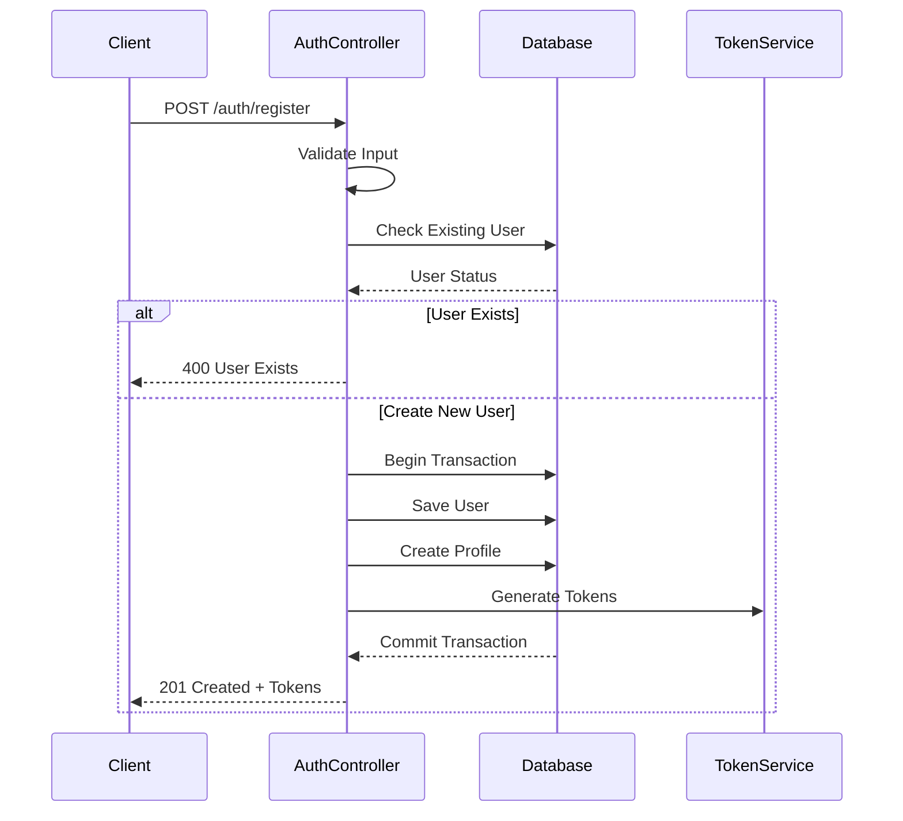

# Authentication System Technical Documentation

## Table of Contents
1. [System Overview](#system-overview)
2. [Technical Architecture](#technical-architecture)
3. [Security Implementation](#security-implementation)
4. [API Documentation](#api-documentation)
5. [Performance Analysis](#performance-analysis)

## System Overview

The authentication system implements a secure, JWT-based authentication flow with role-based access control. It provides comprehensive user management including registration, login, and session handling.

### Key Features
- JWT-based authentication
- Role-based access control (RBAC)
- Secure password hashing
- Transaction-based user creation
- Token refresh mechanism

## Technical Architecture

### Data Models

#### User Schema
```javascript
const UserSchema = new mongoose.Schema({
    username: {
        type: String,
        required: [true, 'Username is required'],
        unique: true,
        trim: true,
        minlength: [3, 'Username must be at least 3 characters long'],
        maxlength: [20, 'Username cannot exceed 20 characters']
    },
    email: {
        type: String,
        required: [true, 'Email is required'],
        unique: true,
        lowercase: true,
        validate: {
            validator: validator.isEmail,
            message: 'Please provide a valid email address'
        }
    },
    password: {
        type: String,
        required: [true, 'Password is required'],
        minlength: [8, 'Password must be at least 8 characters long'],
        select: false
    }
    // ... additional fields
});
```

### Authentication Flow



## Security Implementation

### Password Security
- Bcrypt hashing with salt rounds = 10
- Automatic salt generation per password
- Password complexity requirements:
  - Minimum 8 characters
  - Must include uppercase, lowercase, number, special character

### Token Management
```javascript
static generateTokens(userId, role) {
    const accessToken = jwt.sign(
        { userId, role },
        process.env.JWT_SECRET,
        { expiresIn: '15m' }
    );
    const refreshToken = jwt.sign(
        { userId, role, type: 'refresh' },
        process.env.JWT_SECRET,
        { expiresIn: '7d' }
    );
    return { accessToken, refreshToken };
}
```

### Security Features
1. Password Protection
   - Never returned in queries (select: false)
   - Hashed using bcrypt middleware
   - Complexity validation

2. Input Validation
   - Express-validator middleware
   - MongoDB schema validation
   - Custom validation rules

3. Attack Prevention
   - Rate limiting on auth endpoints
   - SQL injection protection via Mongoose
   - XSS protection via input sanitization
   - CSRF token validation

## API Documentation

### Registration Endpoint
- **URL**: `/auth/register`
- **Method**: `POST`
- **Body**:
  ```json
  {
    "username": "string",
    "email": "string",
    "password": "string",
    "firstName": "string",
    "lastName": "string"
  }
  ```
- **Success Response**: `201 Created`
- **Error Response**: `400 Bad Request`

### Login Endpoint
- **URL**: `/auth/login`
- **Method**: `POST`
- **Body**:
  ```json
  {
    "email": "string",
    "password": "string"
  }
  ```
- **Success Response**: `200 OK`
- **Error Response**: `401 Unauthorized`

## Performance Analysis

### Query Optimization
- Indexed fields: email, username
- Selective password retrieval
- Efficient token validation

### Session Management
- Short-lived access tokens (15m)
- Long-lived refresh tokens (7d)
- Stateless authentication

### Recommendations
1. Implement 2FA support
2. Add IP-based suspicious activity detection
3. Enhance password complexity requirements
4. Add brute force protection
5. Implement secure password reset flow

---

**Last Updated**: 2025-02-23
**Author**: Technical Documentation Team
