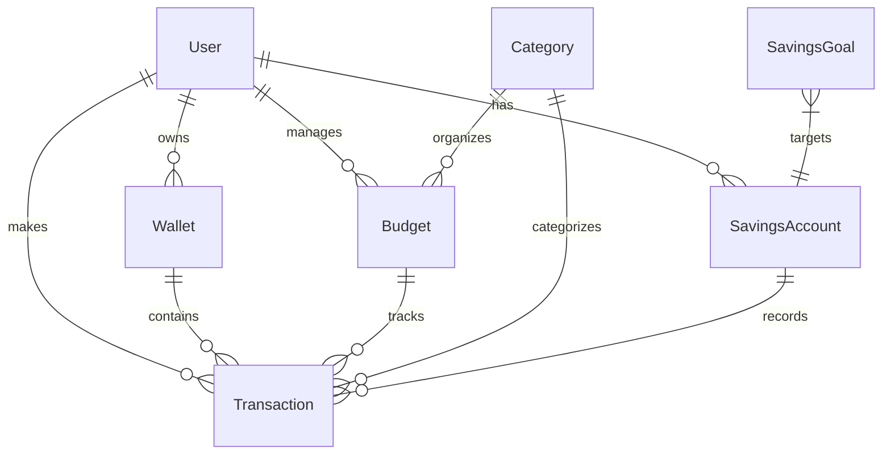

# Financial System Models Documentation

## Table of Contents
1. [Overview](#overview)
2. [Core Models](#core-models)
3. [Relationships](#relationships)
4. [Business Logic](#business-logic)
5. [Data Integrity](#data-integrity)

## Overview

The financial system is built on a robust set of interconnected models that handle various aspects of personal finance management, including:
- Wallet management
- Transaction tracking
- Budget planning
- Savings accounts
- Financial goals

## Core Models

### Wallet Model
```javascript
const WalletSchema = new mongoose.Schema({
    userId: {
        type: mongoose.Schema.Types.ObjectId,
        ref: 'User',
        required: true
    },
    name: {
        type: String,
        required: true,
        trim: true
    },
    balance: {
        type: Number,
        default: 0,
        validate: {
            validator: value => value >= 0,
            message: 'Balance cannot be negative'
        }
    },
    currency: {
        type: String,
        required: true,
        default: 'USD'
    },
    type: {
        type: String,
        enum: ['cash', 'bank', 'credit', 'investment'],
        default: 'cash'
    }
});
```

### Transaction Model
```javascript
const transactionSchema = new mongoose.Schema({
    userId: {
        type: mongoose.Schema.Types.ObjectId,
        ref: 'User',
        required: true
    },
    amount: {
        type: Number,
        required: true
    },
    type: {
        type: String,
        enum: ['income', 'expense', 'transfer'],
        required: true
    },
    category: {
        type: mongoose.Schema.Types.ObjectId,
        ref: 'Category',
        required: true
    },
    description: String,
    date: {
        type: Date,
        default: Date.now
    },
    walletId: {
        type: mongoose.Schema.Types.ObjectId,
        ref: 'Wallet'
    },
    budgetId: {
        type: mongoose.Schema.Types.ObjectId,
        ref: 'Budget'
    }
});
```

### Budget Model
```javascript
const budgetSchema = new mongoose.Schema({
    userId: {
        type: mongoose.Schema.Types.ObjectId,
        ref: 'User',
        required: true
    },
    name: {
        type: String,
        required: true
    },
    amount: {
        type: Number,
        required: true,
        min: [0, 'Budget amount cannot be negative']
    },
    category: {
        type: mongoose.Schema.Types.ObjectId,
        ref: 'Category',
        required: true
    },
    period: {
        type: String,
        enum: ['daily', 'weekly', 'monthly', 'yearly'],
        default: 'monthly'
    },
    startDate: {
        type: Date,
        required: true
    },
    endDate: {
        type: Date,
        required: true
    }
});
```

### Savings Account Model
```javascript
const SavingsAccountSchema = new mongoose.Schema({
    userId: {
        type: mongoose.Schema.Types.ObjectId,
        ref: 'User',
        required: true
    },
    name: {
        type: String,
        required: true
    },
    balance: {
        type: Number,
        default: 0
    },
    targetAmount: {
        type: Number,
        required: true
    },
    autoSave: {
        enabled: Boolean,
        amount: Number,
        frequency: {
            type: String,
            enum: ['monthly', 'weekly']
        }
    }
});
```

## Relationships



## Business Logic

### Transaction Processing
```javascript
// Transaction validation and processing
transactionSchema.pre('save', async function(next) {
    if (this.type === 'expense' && this.budgetId) {
        const budget = await Budget.findById(this.budgetId);
        if (!budget) {
            throw new Error('Budget not found');
        }
        
        // Check if transaction exceeds budget
        const spent = await Transaction.aggregate([
            { $match: { budgetId: this.budgetId } },
            { $group: { _id: null, total: { $sum: '$amount' } } }
        ]);
        
        if (spent[0]?.total + this.amount > budget.amount) {
            throw new Error('Transaction would exceed budget limit');
        }
    }
    next();
});
```

### Budget Management
```javascript
// Update budget spent amount
budgetSchema.statics.updateBudgetSpent = async function(budgetId) {
    const budget = await this.findById(budgetId);
    if (!budget) throw new Error('Budget not found');

    const spent = await Transaction.aggregate([
        { $match: { budgetId: budget._id } },
        { $group: { _id: null, total: { $sum: '$amount' } } }
    ]);

    budget.spent = spent[0]?.total || 0;
    await budget.save();
    return budget;
};
```

### Wallet Balance Management
```javascript
// Update wallet balance
WalletSchema.methods.updateBalance = async function(amount) {
    this.balance += amount;
    if (this.balance < 0) {
        throw new Error('Insufficient funds');
    }
    await this.save();
    return this;
};
```

## Data Integrity

### Validation Rules
1. **Wallet Balance**
   - Cannot be negative
   - Must be updated atomically
   - Transactions must be validated against available balance

2. **Budget Constraints**
   - Cannot exceed allocated amount
   - Must have valid start and end dates
   - Must be associated with a category

3. **Transaction Requirements**
   - Must have valid amount
   - Must be associated with a wallet or savings account
   - Must have a valid category
   - Must respect budget limits if applicable

### Indexing Strategy
```javascript
// Wallet indexes
WalletSchema.index({ userId: 1 });
WalletSchema.index({ userId: 1, type: 1 });

// Transaction indexes
transactionSchema.index({ userId: 1, date: -1 });
transactionSchema.index({ walletId: 1, date: -1 });
transactionSchema.index({ budgetId: 1, date: -1 });
transactionSchema.index({ category: 1, date: -1 });

// Budget indexes
budgetSchema.index({ userId: 1, period: 1 });
budgetSchema.index({ category: 1, startDate: 1, endDate: 1 });
```

## Performance Considerations

### Aggregation Optimization
1. **Transaction Statistics**
   - Use date-based aggregation for reports
   - Implement caching for frequent calculations
   - Use compound indexes for common queries

2. **Budget Tracking**
   - Maintain running totals
   - Use incremental updates
   - Implement periodic reconciliation

### Data Access Patterns
```javascript
// Efficient transaction retrieval
static async getTransactionsByPeriod(userId, startDate, endDate) {
    return this.aggregate([
        {
            $match: {
                userId,
                date: { $gte: startDate, $lte: endDate }
            }
        },
        {
            $lookup: {
                from: 'categories',
                localField: 'category',
                foreignField: '_id',
                as: 'categoryDetails'
            }
        },
        {
            $sort: { date: -1 }
        }
    ]).exec();
}
```

---

**Last Updated**: 2025-02-23
**Author**: Database Architecture Team
