# CoinDrop Technical Architecture

## Application Architecture

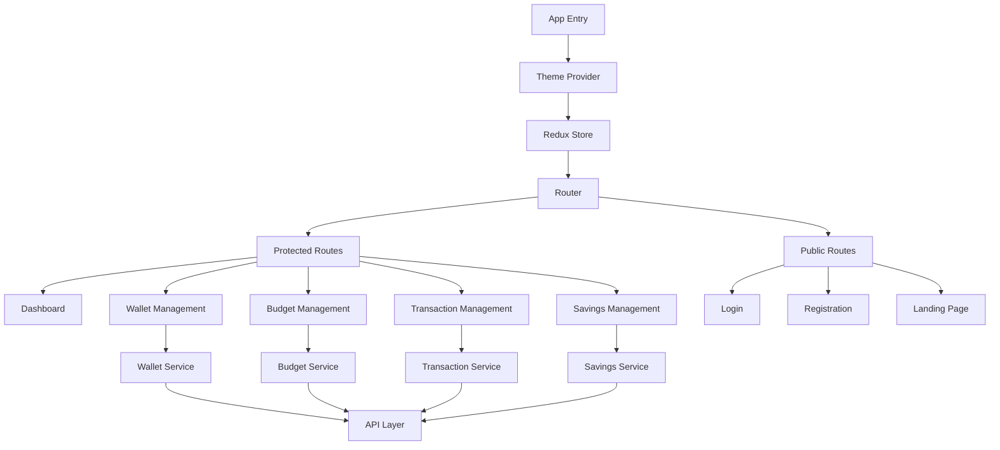

## Data Flow Architecture

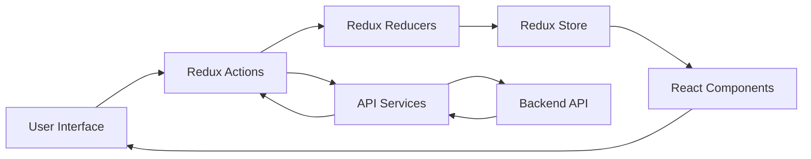

## Component Architecture

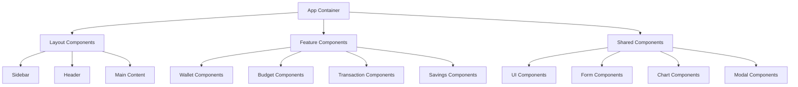

## State Management Architecture

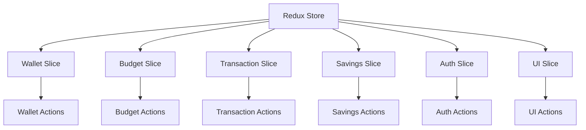

## Authentication Flow

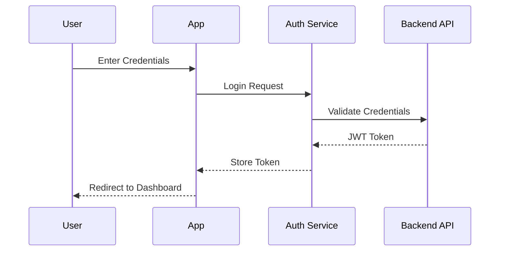

## Transaction Flow

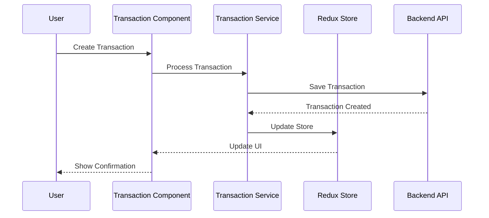

## Theme System Architecture

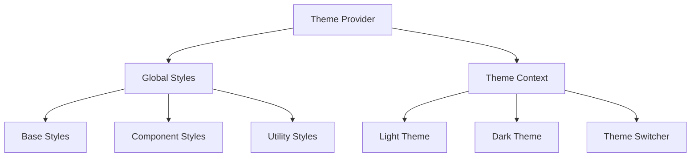

## Service Layer Architecture

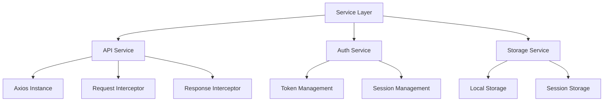

## Error Handling Architecture

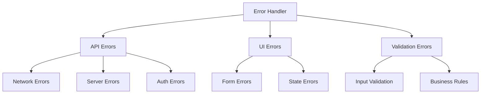

## Testing Architecture

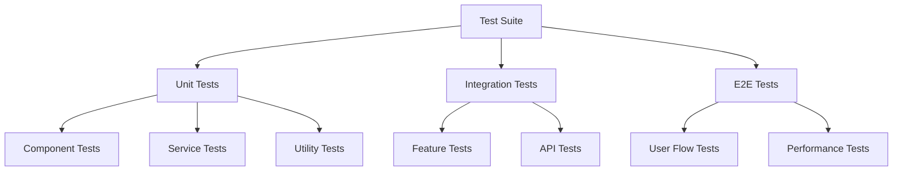

## Build and Deployment Architecture

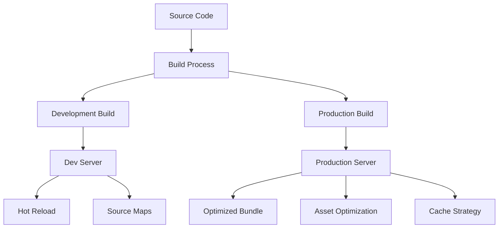

## Performance Optimization Architecture

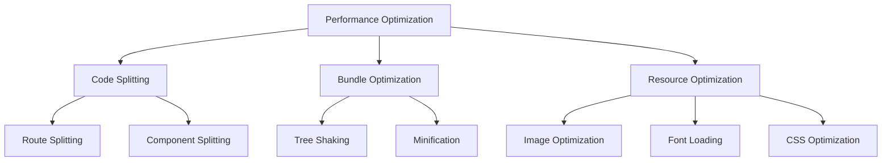

This technical architecture documentation provides a comprehensive view of how different parts of the CoinDrop frontend application interact and work together. The diagrams help visualize:

1. Overall application structure
2. Data flow patterns
3. Component hierarchy
4. State management
5. Authentication process
6. Transaction handling
7. Theme system
8. Service layer
9. Error handling
10. Testing strategy
11. Build and deployment
12. Performance optimization

Each diagram is accompanied by detailed explanations in the main Frontend Overview document.
