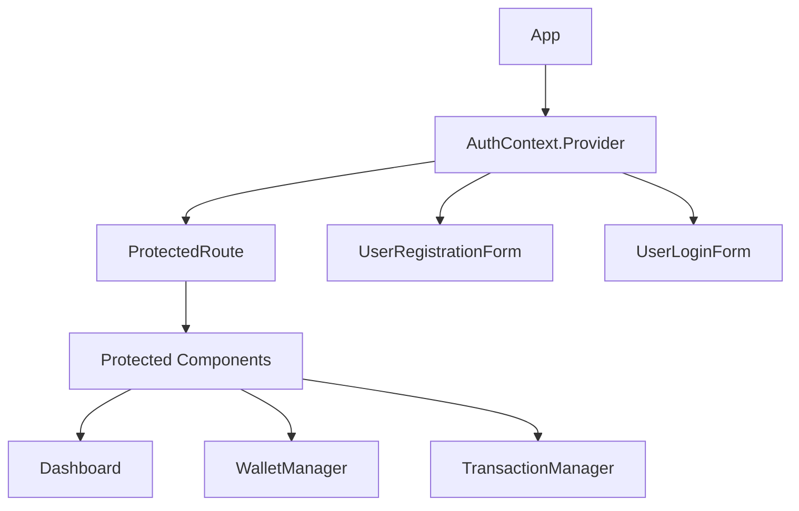

# Authentication Components Documentation

## Table of Contents
1. [Component Overview](#component-overview)
2. [Component Architecture](#component-architecture)
3. [Implementation Details](#implementation-details)
4. [State Management](#state-management)
5. [Security Features](#security-features)

## Component Overview

The frontend authentication system consists of several React components that handle user registration, login, and protected routes. These components work together to provide a secure and user-friendly authentication experience.

### Key Components
- UserRegistrationForm
- UserLoginForm
- ProtectedRoute
- AuthContext

## Component Architecture

### Component Hierarchy


## Implementation Details

### Registration Form Component
```jsx
const UserRegistration = () => {
    const [formData, setFormData] = useState({
        username: '',
        email: '',
        password: '',
        confirmPassword: '',
        firstName: '',
        lastName: '',
        phone: ''
    });

    // Form validation
    const handleSubmit = async (e) => {
        e.preventDefault();
        
        // Validation checks
        if (formData.password !== formData.confirmPassword) {
            toast.error('Passwords do not match');
            return;
        }

        if (formData.password.length < 8) {
            toast.error('Password must be at least 8 characters long');
            return;
        }

        // Password complexity check
        const passwordRegex = /^(?=.*[a-z])(?=.*[A-Z])(?=.*\d)(?=.*[@$!%*?&])[A-Za-z\d@$!%*?&]{8,}$/;
        if (!passwordRegex.test(formData.password)) {
            toast.error('Password must include uppercase, lowercase, number, and special character');
            return;
        }

        try {
            await registerUser(formData);
            toast.success('Account created successfully!');
            navigate('/dashboard');
        } catch (err) {
            handleError(err);
        }
    };
};
```

### Protected Route Component
```jsx
const ProtectedRoute = ({ children }) => {
    const { isAuthenticated, loading } = useAuth();
    const location = useLocation();

    if (loading) {
        return <LoadingSpinner />;
    }

    if (!isAuthenticated) {
        return <Navigate to="/login" state={{ from: location }} replace />;
    }

    return children;
};
```

## State Management

### Authentication Context
```jsx
const AuthContext = createContext({
    user: null,
    isAuthenticated: false,
    loading: true,
    login: () => {},
    logout: () => {},
    updateUser: () => {}
});
```

### Redux Integration
```javascript
// Auth Slice
const authSlice = createSlice({
    name: 'auth',
    initialState: {
        user: null,
        token: null,
        loading: false,
        error: null
    },
    reducers: {
        setUser: (state, action) => {
            state.user = action.payload;
        },
        setToken: (state, action) => {
            state.token = action.payload;
        },
        clearAuth: (state) => {
            state.user = null;
            state.token = null;
        }
    }
});
```

## Security Features

### Frontend Security Measures

1. Form Validation
   - Real-time password strength validation
   - Email format verification
   - Username uniqueness check

2. Token Management
   - Secure token storage in memory
   - Automatic token refresh
   - Token expiration handling

3. Route Protection
   - Authentication state verification
   - Redirect handling
   - Loading state management

4. Error Handling
   - Comprehensive error messages
   - User-friendly notifications
   - Error state management

### Best Practices Implementation

1. Input Sanitization
```javascript
const sanitizeInput = (input) => {
    return input.trim().replace(/[<>]/g, '');
};
```

2. Token Storage
```javascript
// Secure token storage in memory only
const storeUserData = (token, userData) => {
    // Do not store sensitive data in localStorage
    sessionStorage.setItem('user', JSON.stringify({
        id: userData.id,
        username: userData.username,
        email: userData.email
    }));
};
```

3. Automatic Logout
```javascript
const handleTokenExpiration = () => {
    const tokenExp = decode(token).exp;
    const timeToExpire = tokenExp * 1000 - Date.now();
    
    if (timeToExpire <= 0) {
        logout();
        return;
    }
    
    setTimeout(logout, timeToExpire);
};
```

## Performance Considerations

1. Component Optimization
   - Memoization of expensive computations
   - Lazy loading of components
   - Efficient form state management

2. Error Boundary Implementation
```jsx
class AuthErrorBoundary extends React.Component {
    state = { hasError: false };

    static getDerivedStateFromError(error) {
        return { hasError: true };
    }

    componentDidCatch(error, errorInfo) {
        console.error('Auth Error:', error, errorInfo);
    }

    render() {
        if (this.state.hasError) {
            return <ErrorFallback />;
        }
        return this.props.children;
    }
}
```

---

**Last Updated**: 2025-02-23
**Author**: Frontend Documentation Team
