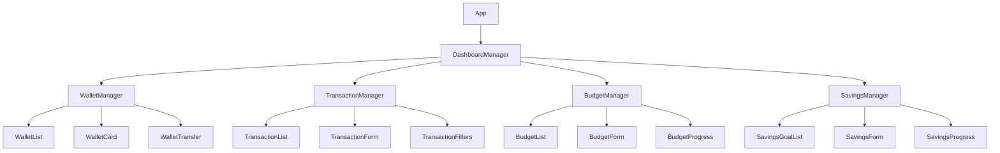

# Financial System Frontend Components

## Table of Contents
1. [Component Overview](#component-overview)
2. [Component Architecture](#component-architecture)
3. [Core Components](#core-components)
4. [State Management](#state-management)
5. [UI/UX Patterns](#ui-ux-patterns)

## Component Overview

The frontend financial system consists of several React components that provide a comprehensive interface for managing personal finances. The system includes:

- Wallet management
- Transaction tracking
- Budget planning
- Savings goals
- Financial analytics

## Component Architecture



## Core Components

### Wallet Manager
```jsx
const WalletManager = () => {
    const dispatch = useDispatch();
    const { wallets, loading, error } = useSelector(state => state.wallet);
    const { user } = useSelector(state => state.auth);
    
    useEffect(() => {
        if (user?.id) {
            fetchWallets();
        }
    }, [user]);

    const fetchWallets = async () => {
        dispatch(setLoading(true));
        try {
            const walletData = await walletService.getAllWallets(user.id);
            dispatch(setWallets(walletData.wallets || []));
        } catch (error) {
            dispatch(setError(error.message));
        } finally {
            dispatch(setLoading(false));
        }
    };

    return (
        <div className="wallet-manager">
            <WalletList 
                wallets={wallets}
                onWalletUpdate={handleWalletUpdate}
                onWalletDelete={handleWalletDelete}
                onTransfer={handleTransfer}
            />
            <WalletStats wallets={wallets} />
        </div>
    );
};
```

### Transaction Manager
```jsx
const TransactionManager = () => {
    const [transactions, setTransactions] = useState([]);
    const [filters, setFilters] = useState({
        startDate: null,
        endDate: null,
        category: null,
        type: null
    });

    const fetchTransactions = async () => {
        try {
            const response = await transactionService.getUserTransactions(
                user.id,
                filters
            );
            setTransactions(response.data);
        } catch (error) {
            toast.error('Failed to fetch transactions');
        }
    };

    return (
        <div className="transaction-manager">
            <TransactionFilters
                filters={filters}
                onFilterChange={handleFilterChange}
            />
            <TransactionList
                transactions={transactions}
                onEdit={handleEdit}
                onDelete={handleDelete}
            />
            <TransactionStats transactions={transactions} />
        </div>
    );
};
```

## State Management

### Redux Store Structure
```javascript
const initialState = {
    wallet: {
        wallets: [],
        loading: false,
        error: null,
        selectedWallet: null
    },
    transaction: {
        transactions: [],
        loading: false,
        error: null,
        filters: {
            startDate: null,
            endDate: null,
            category: null,
            type: null
        }
    },
    budget: {
        budgets: [],
        loading: false,
        error: null,
        currentPeriod: 'monthly'
    },
    savings: {
        accounts: [],
        goals: [],
        loading: false,
        error: null
    }
};
```

### Redux Actions and Reducers
```javascript
// Wallet Actions
const walletSlice = createSlice({
    name: 'wallet',
    initialState,
    reducers: {
        setWallets: (state, action) => {
            state.wallets = action.payload;
        },
        updateWallet: (state, action) => {
            const index = state.wallets.findIndex(w => w.id === action.payload.id);
            if (index !== -1) {
                state.wallets[index] = action.payload;
            }
        },
        deleteWallet: (state, action) => {
            state.wallets = state.wallets.filter(w => w.id !== action.payload);
        }
    }
});
```

## UI/UX Patterns

### Responsive Design
```jsx
const WalletCard = ({ wallet, onUpdate, onDelete }) => {
    const theme = useTheme();
    
    return (
        <div className={`wallet-card ${theme.isDark ? 'dark' : 'light'}`}>
            <div className="wallet-header">
                <h3>{wallet.name}</h3>
                <span className="wallet-type">{wallet.type}</span>
            </div>
            <div className="wallet-balance">
                <span className="currency">{wallet.currency}</span>
                <span className="amount">{formatCurrency(wallet.balance)}</span>
            </div>
            <div className="wallet-actions">
                <Button onClick={() => onUpdate(wallet)}>Edit</Button>
                <Button variant="danger" onClick={() => onDelete(wallet.id)}>
                    Delete
                </Button>
            </div>
        </div>
    );
};
```

### Data Visualization
```jsx
const TransactionChart = ({ transactions }) => {
    const chartData = useMemo(() => {
        return transactions.reduce((acc, transaction) => {
            const date = format(new Date(transaction.date), 'yyyy-MM-dd');
            acc[date] = (acc[date] || 0) + transaction.amount;
            return acc;
        }, {});
    }, [transactions]);

    return (
        <LineChart
            data={Object.entries(chartData).map(([date, amount]) => ({
                date,
                amount
            }))}
            xAxis="date"
            yAxis="amount"
            tooltip
            legend
        />
    );
};
```

## Error Handling

### Global Error Boundary
```jsx
class FinancialErrorBoundary extends React.Component {
    state = { hasError: false, error: null };

    static getDerivedStateFromError(error) {
        return { hasError: true, error };
    }

    componentDidCatch(error, errorInfo) {
        console.error('Financial component error:', error, errorInfo);
        // Log to error tracking service
    }

    render() {
        if (this.state.hasError) {
            return (
                <ErrorFallback
                    error={this.state.error}
                    onReset={() => this.setState({ hasError: false })}
                />
            );
        }
        return this.props.children;
    }
}
```

### Form Validation
```jsx
const TransactionForm = ({ onSubmit }) => {
    const [errors, setErrors] = useState({});
    
    const validateForm = (data) => {
        const newErrors = {};
        
        if (!data.amount || data.amount <= 0) {
            newErrors.amount = 'Amount must be greater than 0';
        }
        
        if (!data.category) {
            newErrors.category = 'Category is required';
        }
        
        if (!data.walletId) {
            newErrors.walletId = 'Wallet is required';
        }
        
        return newErrors;
    };

    const handleSubmit = (e) => {
        e.preventDefault();
        const formData = new FormData(e.target);
        const data = Object.fromEntries(formData);
        
        const formErrors = validateForm(data);
        if (Object.keys(formErrors).length > 0) {
            setErrors(formErrors);
            return;
        }
        
        onSubmit(data);
    };

    return (
        <form onSubmit={handleSubmit}>
            {/* Form fields */}
        </form>
    );
};
```

## Performance Optimization

### Memoization
```jsx
const WalletStats = memo(({ wallets }) => {
    const stats = useMemo(() => {
        return {
            totalBalance: wallets.reduce((sum, w) => sum + w.balance, 0),
            totalWallets: wallets.length,
            avgBalance: wallets.length ? 
                wallets.reduce((sum, w) => sum + w.balance, 0) / wallets.length : 
                0
        };
    }, [wallets]);

    return (
        <div className="wallet-stats">
            <StatCard label="Total Balance" value={stats.totalBalance} />
            <StatCard label="Total Wallets" value={stats.totalWallets} />
            <StatCard label="Average Balance" value={stats.avgBalance} />
        </div>
    );
});
```

---

**Last Updated**: 2025-02-23
**Author**: Frontend Development Team
