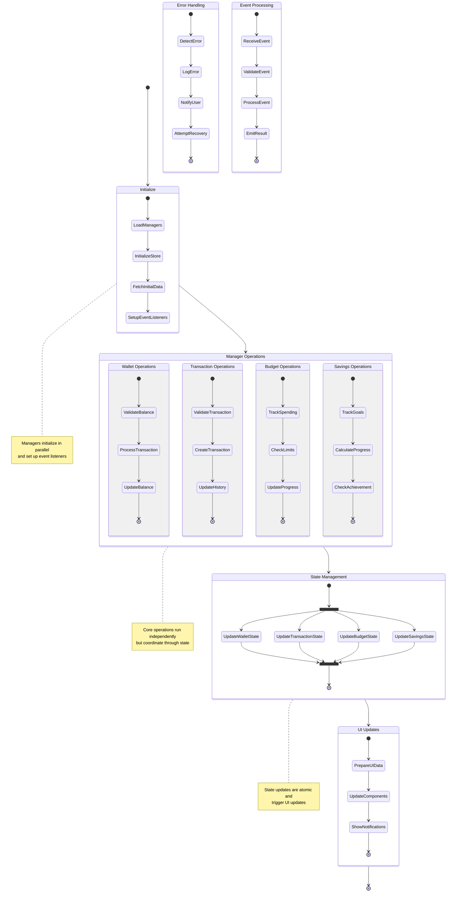

# Core Manager Components Activity Diagram

## Description

**Purpose**: This diagram illustrates the workflow and activities of the core Manager components in the CoinDrop system, showing how they coordinate to handle financial operations and maintain system state. It demonstrates the parallel processing and decision points in the management layer.

**Key Elements**:
- Manager Activities: Core operations of each manager
- Parallel Processes: Concurrent operations
- Decision Points: Business logic validation
- State Updates: Store synchronization

**System Context**: This diagram is essential to Section 3.10 of the thesis, which details the workflow and coordination between core manager components in handling complex financial operations.

## Mermaid Code

## Workflow Phases

1. **Initialization**
   - Manager loading
   - Store initialization
   - Initial data fetching
   - Event listener setup

2. **Core Operations**
   - Wallet management
   - Transaction processing
   - Budget tracking
   - Savings monitoring

3. **State Management**
   - Parallel state updates
   - Store synchronization
   - Cache management
   - Event emission

4. **UI Updates**
   - Component updates
   - Notification handling
   - Error display
   - Loading states

## Manager Activities

1. **WalletManager**
   - Balance validation
   - Transaction processing
   - Balance updates
   - State synchronization

2. **TransactionManager**
   - Transaction validation
   - Creation and updates
   - History management
   - Category handling

3. **BudgetManager**
   - Spending tracking
   - Limit checking
   - Progress updates
   - Alert generation

4. **SavingsManager**
   - Goal tracking
   - Progress calculation
   - Achievement checking
   - Notification handling

## State Coordination

1. **Parallel Updates**
   - Multiple manager updates
   - State synchronization
   - Event propagation
   - Cache invalidation

2. **Event Processing**
   - Event validation
   - Processing logic
   - Result emission
   - Error handling

3. **UI Synchronization**
   - Component updates
   - Data preparation
   - Notification handling
   - Loading states

## Error Handling

1. **Error Detection**
   - Validation errors
   - API errors
   - State errors
   - Business rule violations

2. **Error Recovery**
   - State rollback
   - Retry logic
   - User notification
   - Logging

## Performance Optimization

1. **Parallel Processing**
   - Independent operations
   - State batching
   - Event queuing
   - Cache management

2. **Resource Management**
   - Memory optimization
   - Event debouncing
   - Cache invalidation
   - Cleanup processes

## Integration Points

This activity diagram connects with:
- Manager Interactions sequence diagram
- Service Layer class diagram
- Core Domain Model
- State Management documentation
