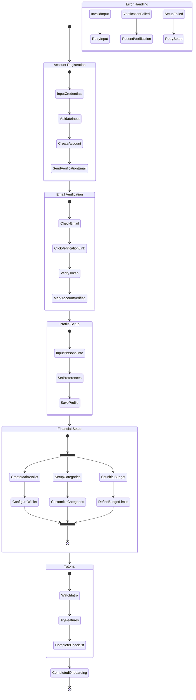

# User Onboarding Activity Diagram

## Description

**Purpose**: This diagram illustrates the complete user onboarding process in the CoinDrop Financial Management System, from initial registration through setup of essential financial components. It shows the workflow and decision points that guide a new user through the system setup.

**Key Elements**:
- Activities: Registration, verification, profile setup, wallet creation
- Decision Points: Email verification, optional steps
- Parallel Activities: Concurrent setup processes
- Swimlanes: User actions and system processes

**System Context**: This diagram is essential to Section 3.6 of the thesis, which details the user experience and onboarding process. It demonstrates how the system guides new users through the setup process while maintaining security and usability.

## Mermaid Code

## Process Flow

1. **Account Registration**:
   - User enters registration details
   - System validates input
   - Account is created
   - Verification email is sent

2. **Email Verification**:
   - User receives verification email
   - Clicks verification link
   - System verifies token
   - Account is marked as verified

3. **Profile Setup**:
   - User enters personal information
   - Sets preferences (currency, language)
   - Profile is saved

4. **Financial Setup** (Parallel Processes):
   - Create and configure main wallet
   - Set up transaction categories
   - Define initial budget limits

5. **Tutorial**:
   - Watch introduction video
   - Try key features
   - Complete onboarding checklist

## Decision Points

1. **Input Validation**:
   - Email format validation
   - Password strength requirements
   - Required field checks

2. **Verification Checks**:
   - Email verification status
   - Token validity
   - Account status

3. **Setup Completion**:
   - Required vs. optional steps
   - Feature enablement
   - Tutorial completion

## Error Handling

1. **Registration Errors**:
   - Invalid input retry
   - Duplicate email handling
   - System error recovery

2. **Verification Issues**:
   - Token expiration
   - Invalid token
   - Resend verification

3. **Setup Failures**:
   - Data validation errors
   - System connectivity issues
   - Recovery procedures

## Integration Points

This activity diagram connects with:
- User Authentication use case
- User Registration sequence diagram
- Core Domain Model class diagram
- User Schema database diagram

## Success Criteria

1. **Account Creation**:
   - Valid user account created
   - Email verified
   - Profile completed

2. **Financial Setup**:
   - Main wallet configured
   - Categories customized
   - Initial budget set

3. **System Readiness**:
   - All required features enabled
   - Tutorial completed
   - User ready for active use
