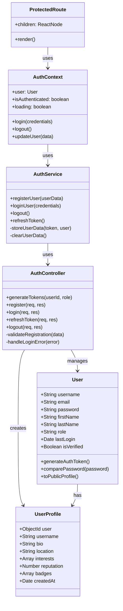
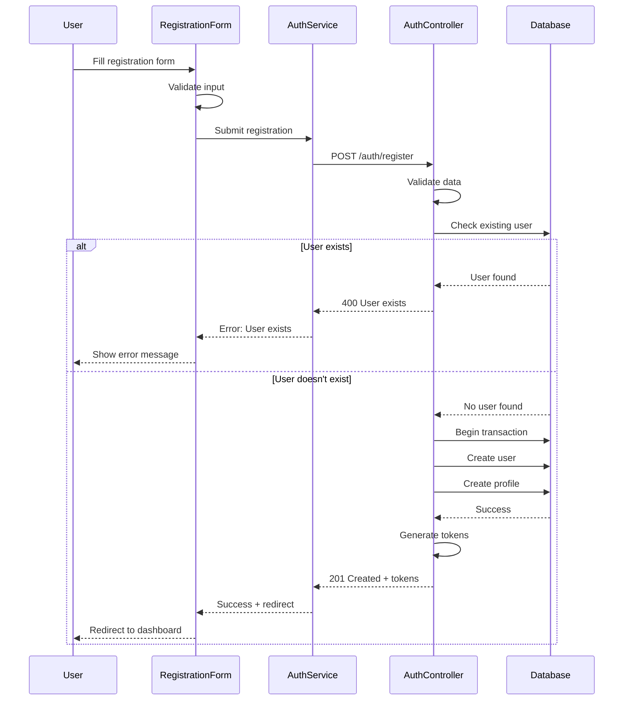
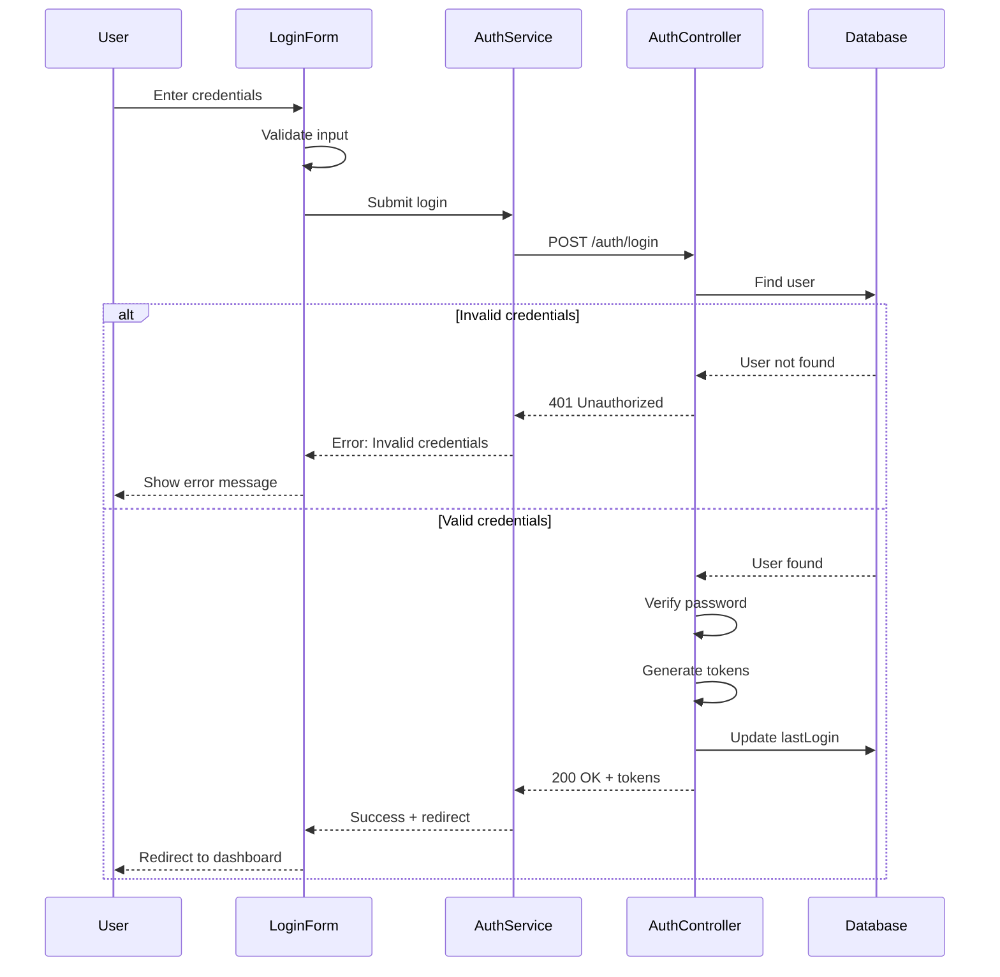
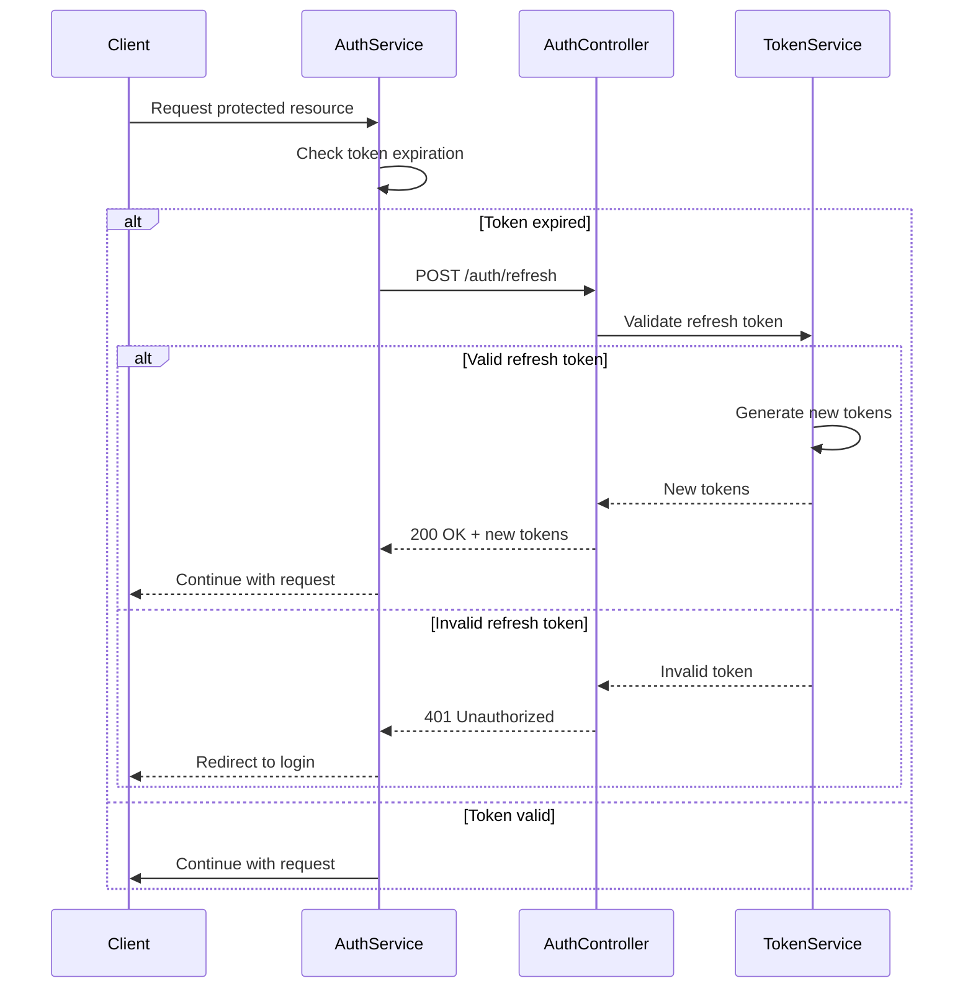
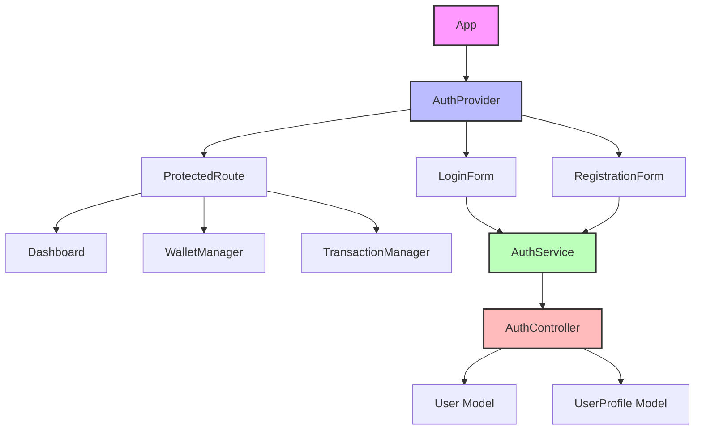

# Authentication System UML Diagrams

## Class Diagram

## Sequence Diagrams

### Registration Flow

### Login Flow

### Token Refresh Flow

## Component Diagram

---

**Last Updated**: 2025-02-23
**Author**: System Architecture Team
