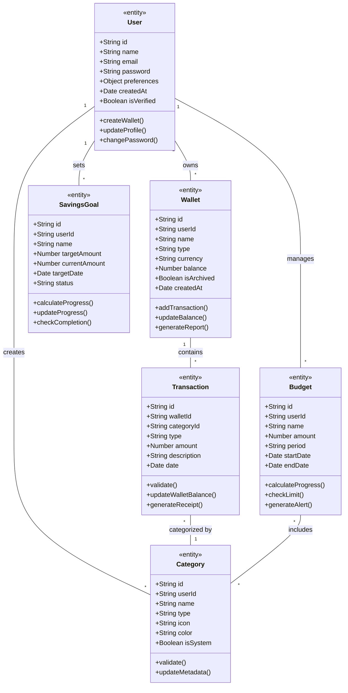

# Core Domain Model Class Diagram

## Description

**Purpose**: This diagram represents the core domain model of the CoinDrop Financial Management System, showing the main entities and their relationships. It illustrates how different components of the system are structured and interact with each other.

**Key Elements**:
- Core Classes: User, Wallet, Transaction, Budget, SavingsGoal
- Relationships: Inheritance, Association, Composition, Aggregation
- Attributes: Essential properties of each class
- Methods: Key operations for each class

**System Context**: This diagram is fundamental to Section 3.4 of the thesis, which details the system's domain model and architectural design. It serves as the foundation for understanding the system's data structure and business logic.

## Mermaid Code

## Class Descriptions

1. **User**:
   - Central entity representing system users
   - Manages authentication and profile information
   - Links to all other major entities

2. **Wallet**:
   - Represents financial accounts
   - Tracks balance and transactions
   - Supports multiple currencies

3. **Transaction**:
   - Records financial movements
   - Links to wallets and categories
   - Maintains audit trail

4. **Budget**:
   - Defines spending limits
   - Tracks expenses by category
   - Generates alerts and reports

5. **Category**:
   - Classifies transactions
   - Supports custom categorization
   - Used in budgeting and reporting

6. **SavingsGoal**:
   - Tracks savings targets
   - Monitors progress
   - Manages completion status

## Relationships

1. **One-to-Many**:
   - User → Wallets
   - User → Budgets
   - User → Categories
   - User → SavingsGoals
   - Wallet → Transactions

2. **Many-to-Many**:
   - Budget ↔ Categories

3. **Dependencies**:
   - Transactions depend on Categories
   - Budgets depend on Categories
   - Transactions affect Wallet balances

## Design Patterns

1. **Entity Pattern**:
   - All main classes are entities with unique identifiers
   - Consistent attribute structure
   - Standard CRUD operations

2. **Value Objects**:
   - Currency representations
   - Date handling
   - Amount calculations

3. **Aggregates**:
   - Wallet as transaction aggregate
   - Budget as category aggregate
   - User as primary aggregate root

## Integration Points

This class diagram connects with:
- Database schema design
- API endpoint structure
- Service layer implementation
- Frontend component organization
