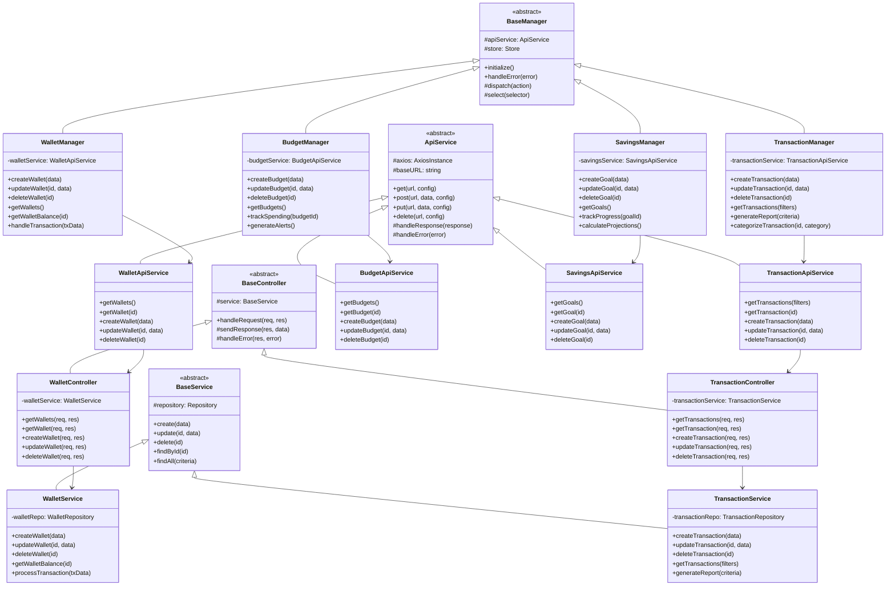

# Service Layer Class Diagram

## Description

**Purpose**: This diagram illustrates the service layer architecture of the CoinDrop system, showing how frontend components connect to backend services through managers and APIs. It demonstrates the complete flow from UI components through managers to backend services.

**Key Elements**:
- Frontend Managers: Core component managers
- API Services: Frontend service layer
- Backend Controllers: API endpoints
- Backend Services: Business logic
- Data Transfer Objects (DTOs)

**System Context**: This diagram is crucial to Section 3.8 of the thesis, which details the system's service layer architecture and the integration between frontend and backend components.

## Mermaid Code



## Component Descriptions

1. **Frontend Managers**
   - Abstract BaseManager with common functionality
   - Specialized managers for each domain
   - State management integration
   - Error handling

2. **API Services**
   - Abstract ApiService with HTTP methods
   - Domain-specific API services
   - Request/response handling
   - Error handling

3. **Backend Controllers**
   - Request handling and validation
   - Service coordination
   - Response formatting
   - Error handling

4. **Backend Services**
   - Business logic implementation
   - Data access coordination
   - Transaction management
   - Domain rules enforcement

## Integration Points

1. **Frontend to API**
   - Managers use API services
   - API services handle HTTP communication
   - DTOs for data transfer
   - Error handling and retries

2. **API to Backend**
   - Controllers receive requests
   - Services process business logic
   - Repositories handle data access
   - Error propagation

3. **Cross-Cutting Concerns**
   - Authentication
   - Error handling
   - Logging
   - Validation

## Data Flow

1. **Request Flow**
   ```
   UI Component → Manager → API Service → Controller → Service → Repository → Database
   ```

2. **Response Flow**
   ```
   Database → Repository → Service → Controller → API Service → Manager → UI Component
   ```

3. **Error Flow**
   ```
   Error Source → Error Handler → API Response → Manager → UI Error Display
   ```

## Design Patterns

1. **Manager Pattern**
   - Centralized component management
   - State coordination
   - Event handling
   - UI updates

2. **Service Pattern**
   - Business logic encapsulation
   - Data access abstraction
   - Transaction management
   - Error handling

3. **Repository Pattern**
   - Data access abstraction
   - Query optimization
   - Caching
   - Data mapping
