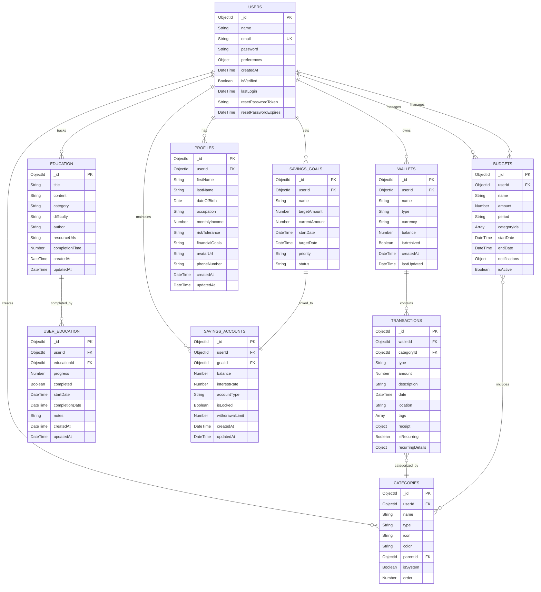

# Database Schema Diagram

## Description

**Purpose**: This diagram provides a comprehensive view of the CoinDrop Financial Management System's database structure. It shows all collections (tables), their relationships, and key fields, illustrating how data is organized and connected within the MongoDB database.

**Key Elements**:
- Collections: Core data structures
- Fields: Important attributes
- Relationships: References between collections
- Indexes: Performance optimization
- Constraints: Data integrity rules

**System Context**: This diagram is fundamental to Section 3.7 of the thesis, which details the system's data architecture. It demonstrates how the system organizes and maintains financial data while ensuring data integrity and query efficiency.

## Mermaid Code



## Collection Details

1. **Users Collection**:
   - Primary user information
   - Authentication data
   - User preferences
   - Security tokens

2. **Profiles Collection**:
   - Detailed user profile information
   - Financial goals and risk tolerance
   - Employment and income details

3. **Wallets Collection**:
   - Financial accounts
   - Balance tracking
   - Currency information
   - Archive status

4. **Transactions Collection**:
   - Financial movements
   - Category classification
   - Receipt attachments
   - Recurring settings

5. **Categories Collection**:
   - Transaction classification
   - Hierarchical structure
   - Visual metadata
   - System vs. custom

6. **Budgets Collection**:
   - Spending limits
   - Period settings
   - Category mapping
   - Notification rules

7. **Savings Goals Collection**:
   - Target amounts
   - Progress tracking
   - Timeline management
   - Priority levels

8. **Education Collection**:
   - Financial education content
   - Resource URLs and completion time
   - Author and category information

9. **User Education Collection**:
   - User progress in educational content
   - Completion status and notes
   - Start and completion dates

10. **Savings Accounts Collection**:
    - Dedicated savings accounts for goals
    - Balance and interest rate information
    - Account type and lock status

## Relationships

1. **One-to-Many**:
   - User → Wallets
   - User → Categories
   - User → Budgets
   - User → Savings Goals
   - User → Profiles
   - User → Education
   - Wallet → Transactions

2. **Many-to-Many**:
   - Budgets ↔ Categories
   - Transactions ↔ Tags
   - Users ↔ Education (through User Education)

3. **References**:
   - Transactions → Categories
   - Categories → Parent Categories
   - All entities → User

## Indexes

1. **Primary Indexes**:
   - `_id` on all collections

2. **Secondary Indexes**:
   ```javascript
   // Users
   { email: 1 } // unique
   { resetPasswordToken: 1 } // sparse

   // Profiles
   { userId: 1 }
   { firstName: 1 }
   { lastName: 1 }

   // Wallets
   { userId: 1 }
   { type: 1 }
   { isArchived: 1 }

   // Transactions
   { walletId: 1, date: -1 }
   { categoryId: 1 }
   { type: 1 }
   { isRecurring: 1 }

   // Categories
   { userId: 1, type: 1 }
   { parentId: 1 }
   { isSystem: 1 }

   // Budgets
   { userId: 1, period: 1 }
   { isActive: 1 }
   { startDate: 1 }

   // Savings Goals
   { userId: 1, status: 1 }
   { targetDate: 1 }

   // Education
   { title: 1 }
   { category: 1 }
   { difficulty: 1 }

   // User Education
   { userId: 1, educationId: 1 }
   { progress: 1 }
   { completed: 1 }

   // Savings Accounts
   { userId: 1, goalId: 1 }
   { balance: 1 }
   { interestRate: 1 }
   ```

## Data Integrity

1. **Required Fields**:
   - User: email, password
   - Wallet: name, type
   - Transaction: amount, type
   - Budget: amount, period
   - Category: name, type
   - SavingsGoal: targetAmount
   - Profile: firstName, lastName
   - Education: title, content
   - UserEducation: progress, completed
   - SavingsAccount: balance, interestRate

2. **Unique Constraints**:
   - User email
   - Wallet name per user
   - Category name per type per user
   - Education title
   - UserEducation user-education pair

3. **Referential Integrity**:
   - Cascade delete for user data
   - Restrict delete for categories
   - Soft delete for transactions

## Query Optimization

1. **Compound Indexes**:
   - Support common queries
   - Cover frequent sorts
   - Enable efficient filtering

2. **Projection Optimization**:
   - Selective field retrieval
   - Minimal data transfer
   - Efficient memory usage

3. **Aggregation Support**:
   - Financial reporting
   - Budget analysis
   - Transaction summaries
