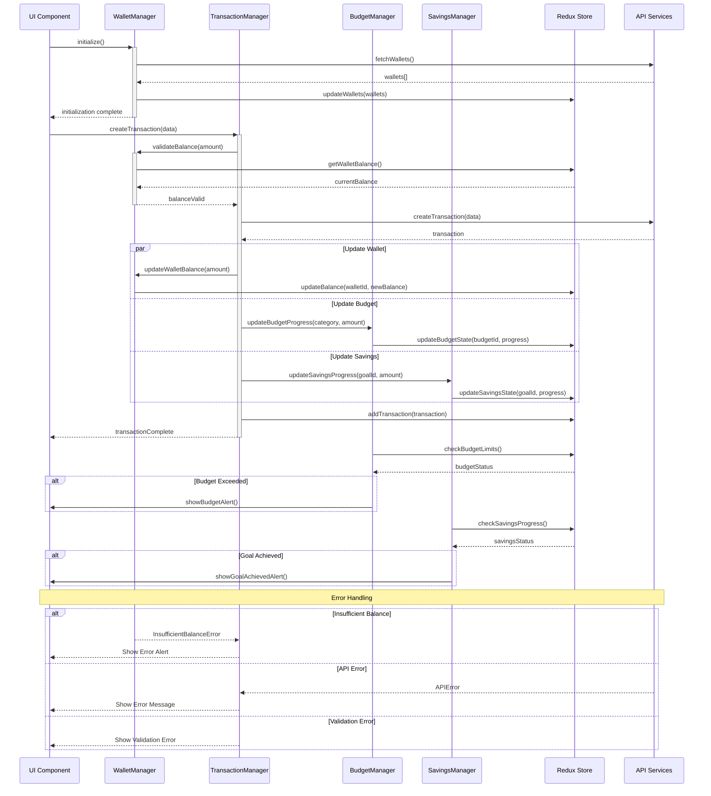

# Core Manager Components Sequence Diagram

## Description

**Purpose**: This diagram illustrates the interactions between core Manager components in the CoinDrop system, showing how they coordinate to handle complex financial operations. It demonstrates the flow of data and control between different managers and their interaction with the Redux store and API services.

**Key Elements**:
- Manager Components: WalletManager, TransactionManager, BudgetManager, SavingsManager
- State Management: Redux Store
- API Services: Backend communication
- Event Handling: Component coordination

**System Context**: This diagram is crucial to Section 3.9 of the thesis, which details how the system's core managers coordinate to maintain data consistency and handle complex financial operations.

## Mermaid Code

## Component Interactions

1. **Initialization Flow**
   - Managers initialize on component mount
   - Initial data fetching
   - Store synchronization
   - UI state setup

2. **Transaction Processing**
   - Balance validation
   - Transaction creation
   - Multi-manager updates
   - Store synchronization

3. **Budget Management**
   - Progress tracking
   - Limit monitoring
   - Alert generation
   - Store updates

4. **Savings Tracking**
   - Goal progress monitoring
   - Achievement checking
   - Alert generation
   - Store updates

## Manager Responsibilities

1. **WalletManager**
   - Balance validation
   - Transaction processing
   - Balance updates
   - State management

2. **TransactionManager**
   - Transaction creation
   - Category management
   - History tracking
   - Error handling

3. **BudgetManager**
   - Budget tracking
   - Limit monitoring
   - Alert generation
   - Progress updates

4. **SavingsManager**
   - Goal tracking
   - Progress calculation
   - Achievement monitoring
   - Alert generation

## State Management

1. **Redux Store**
   - Centralized state
   - Action dispatching
   - State selectors
   - State updates

2. **Manager State Handling**
   - Local state management
   - Store synchronization
   - Error state handling
   - Loading state management

## Error Handling

1. **Validation Errors**
   - Input validation
   - Balance checks
   - Category validation
   - Date validation

2. **API Errors**
   - Network errors
   - Server errors
   - Timeout handling
   - Retry logic

3. **Business Logic Errors**
   - Insufficient balance
   - Budget exceeded
   - Invalid operations
   - State conflicts

## Performance Considerations

1. **State Updates**
   - Batched updates
   - Optimistic updates
   - Cache management
   - Update debouncing

2. **API Optimization**
   - Request batching
   - Response caching
   - Error retries
   - Loading states

3. **UI Responsiveness**
   - Async operations
   - Loading indicators
   - Error feedback
   - Success notifications

## Integration Points

This sequence diagram connects with:
- Service Layer class diagram
- Core Domain Model
- Activity diagrams for specific flows
- API documentation
