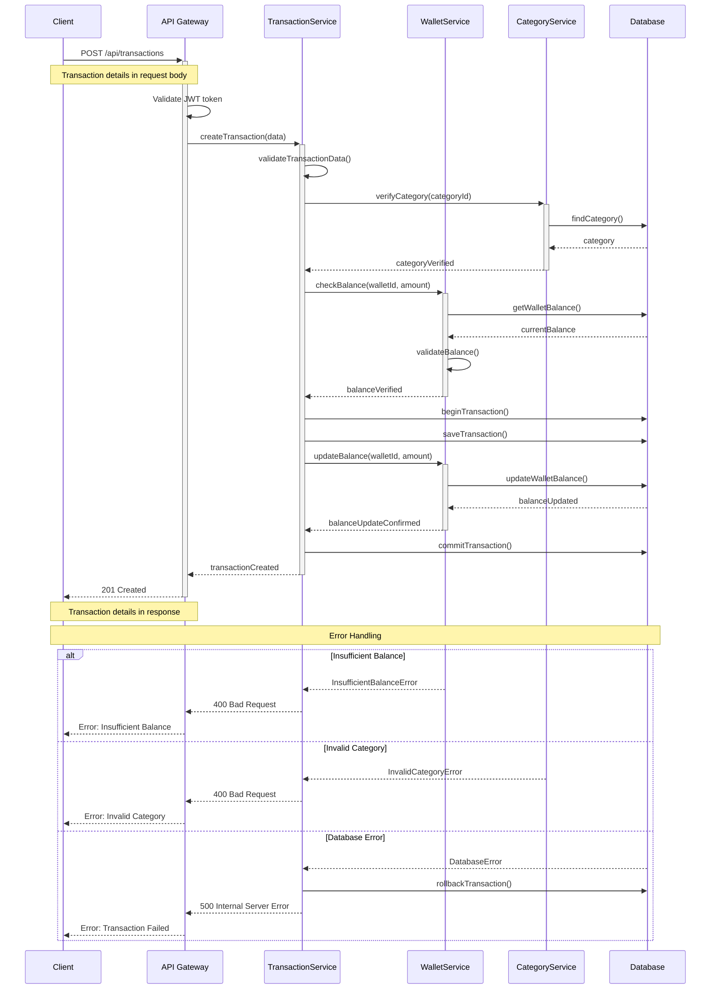

# Transaction Creation Sequence Diagram

## Description

**Purpose**: This diagram illustrates the sequence of interactions between different components of the system during the creation of a new financial transaction. It shows the flow of data and control from the user interface through various system layers to the database.

**Key Elements**:
- Components: Client, API Gateway, Transaction Service, Wallet Service, Database
- Messages: HTTP requests, service calls, database operations
- Validations: Input validation, balance checks, category verification
- Updates: Wallet balance updates, transaction logging

**System Context**: This diagram is crucial to Section 3.5 of the thesis, which details the system's transaction processing capabilities. It demonstrates how the system maintains data consistency and handles concurrent operations.

## Mermaid Code

## Component Interactions

1. **Client to API Gateway**:
   - Client sends transaction creation request
   - Includes transaction details (amount, type, category, etc.)
   - Requires authentication token

2. **API Gateway Processing**:
   - Validates authentication token
   - Routes request to Transaction Service
   - Handles response formatting

3. **Transaction Service**:
   - Validates transaction data
   - Coordinates with other services
   - Manages transaction atomicity
   - Handles error scenarios

4. **Category Service**:
   - Verifies category existence
   - Validates category type
   - Ensures category belongs to user

5. **Wallet Service**:
   - Checks wallet balance
   - Updates wallet balance
   - Ensures atomic updates

6. **Database Operations**:
   - Uses transactions for consistency
   - Handles rollbacks on errors
   - Maintains data integrity

## Error Handling

1. **Validation Errors**:
   - Invalid transaction data
   - Invalid category
   - Insufficient balance

2. **System Errors**:
   - Database failures
   - Service unavailability
   - Network issues

3. **Concurrency Handling**:
   - Transaction isolation
   - Balance update atomicity
   - Deadlock prevention

## Integration Points

This sequence diagram connects with:
- Transaction Management use case
- Core Domain Model class diagram
- Transaction Processing activity diagram
- Database Schema diagram

## Performance Considerations

1. **Optimization**:
   - Minimized database calls
   - Efficient service communication
   - Proper transaction isolation

2. **Scalability**:
   - Stateless service design
   - Independent service scaling
   - Efficient resource usage

3. **Monitoring**:
   - Transaction timing tracking
   - Error rate monitoring
   - Performance metrics collection
