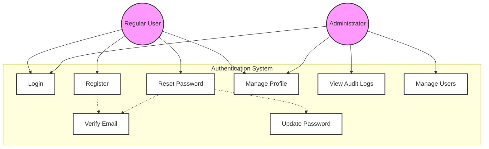

# User Authentication Use Case Diagram

## Description

**Purpose**: This diagram illustrates the authentication and authorization processes within the CoinDrop Financial Management System. It shows how different types of users interact with the authentication system and the relationships between various authentication-related functions.

**Key Elements**:
- Actors: Regular User, Administrator
- Primary Use Cases: Login, Register, Reset Password, Manage Profile
- Supporting Use Cases: Verify Email, Update Password, View Audit Logs
- Relationships: Include, Extend, Association

**System Context**: This diagram is fundamental to Section 3.2 of the thesis, which details the system's security architecture and user management functionality. It demonstrates how the system handles user authentication, authorization, and account management.

## Mermaid Code

## Key Interactions

1. **User Authentication**:
   - Users can log in to the system
   - New users can register for an account
   - Users can reset forgotten passwords
   - Email verification is required for registration and password reset

2. **Profile Management**:
   - Users can manage their profile information
   - Users can update their passwords
   - Users can manage their preferences

3. **Administrative Functions**:
   - Administrators can view audit logs
   - Administrators can manage user accounts
   - Administrators have access to all regular user functions

4. **Security Features**:
   - Email verification for account security
   - Secure password reset process
   - Audit logging for security monitoring

## Integration Points

This use case diagram connects with several other system components:
- Links to the User Management class diagram
- Connects with the Authentication sequence diagram
- Relates to the User Registration activity diagram
- Maps to the User Schema database diagram
