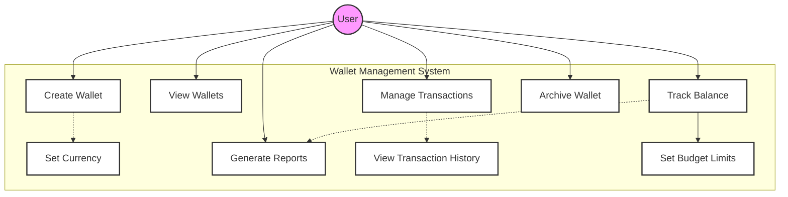

# Wallet Management Use Case Diagram

## Description

**Purpose**: This diagram illustrates the wallet management functionality within the CoinDrop Financial Management System. It shows how users interact with different wallet features and the relationships between various wallet-related operations.

**Key Elements**:
- Actors: Regular User
- Primary Use Cases: Create Wallet, View Wallets, Manage Transactions, Track Balance
- Supporting Use Cases: Set Currency, Archive Wallet, Generate Reports
- Relationships: Include, Extend, Association

**System Context**: This diagram is central to Section 3.3 of the thesis, which details the system's wallet management capabilities. It demonstrates how users can manage multiple wallets, track balances, and handle transactions across different currencies.

## Mermaid Code

## Key Interactions

1. **Wallet Creation and Setup**:
   - Users can create new wallets
   - Users can set wallet currency
   - Users can configure wallet settings

2. **Wallet Management**:
   - Users can view all their wallets
   - Users can archive inactive wallets
   - Users can track wallet balances

3. **Transaction Operations**:
   - Users can manage transactions
   - Users can view transaction history
   - Users can generate transaction reports

4. **Financial Tracking**:
   - Users can track balances across wallets
   - Users can set budget limits
   - Users can generate financial reports

## Integration Points

This use case diagram connects with several other system components:
- Links to the Wallet Management class diagram
- Connects with the Transaction Processing sequence diagram
- Relates to the Wallet Operations activity diagram
- Maps to the Wallet Schema database diagram

## Security Considerations

1. **Access Control**:
   - All wallet operations require user authentication
   - Transactions require additional verification for large amounts
   - Sensitive financial data is protected

2. **Data Integrity**:
   - Transaction history is immutable
   - Balance calculations are atomic
   - Currency conversions are logged

3. **Audit Trail**:
   - All wallet operations are logged
   - Transaction history is maintained
   - Reports can be generated for audit purposes
